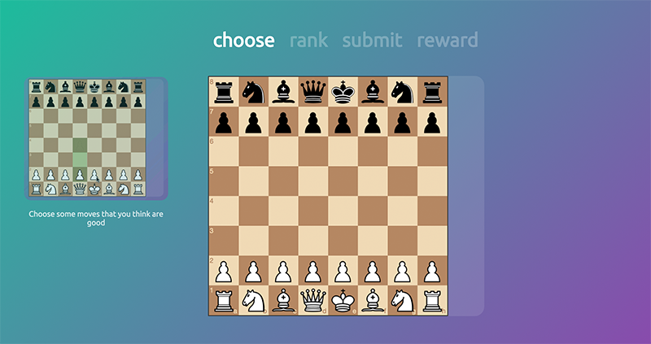
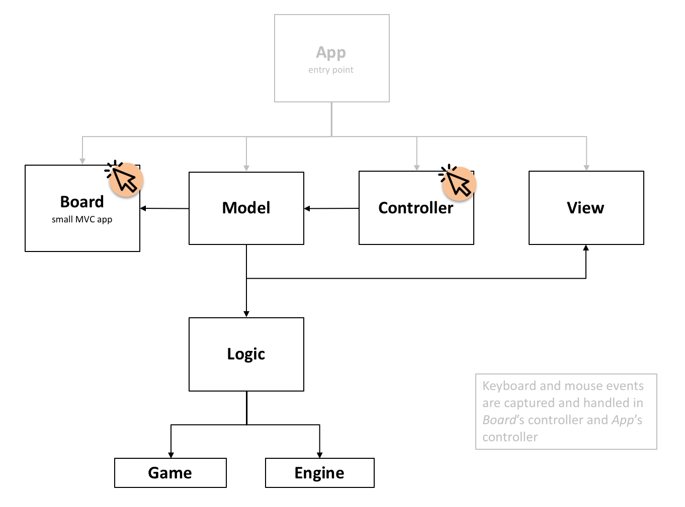

# Chessm8



## Table of Contents

* [What is this project?](#what-is-this-project)
  * [Goal](#goal)
    * [Educational goals](#educational-goals)
  * [What have we done so far?](#what-have-we-done-so-far)
    * [Educational: Ranking chess moves](#educational-ranking-chess-moves)
    * [Fun: Rewards](#fun-rewards)
* [Overview of the technology](#overview-of-the-technology)
* [How to play](#how-to-play)
* [Getting Started](#getting-started)
  * [Set up your Node.js development environment](#set-up-your-nodejs-development-environment)
  * [Get the code](#get-the-code)
  * [Install the packages](#install-the-packages)
  * [Start the server](#start-the-server)
  * [Open your browser](#open-your-browser)
* [Workflow for developing](#workflow-for-developing)
  * [Build tools](#build-tools)
  * [Tests](#tests)
* [Application Architecture](#application-architecture)
  * [App Component](#app-component)
  * [Board Component](#board-component)
  * [Controller Component](#controller-component)
  * [View Component](#view-component)
  * [Model Component](#model-component)
  * [Logic Component](#logic-component)

## What is this project?

Chessm8 (pronouned "chessmate") is about chess, teaching and technology. We want to make an innovative web application that helps beginners and intermediates learn chess more effectively.

### Goal

The app needs to be simple, fun and educational.

* **Simple**: Minimal additions to the normal game of chess
* **Fun**: Players will want to play this instead of normal chess (not all the time, obviously)
* **Educational**: Players will learn something that they wouldn't otherwise learn from other chess applications

#### Educational goals

We plan to address three types of thinking that are important to chess.

* Thinking broadly
* Thinking deeply
* Thinking from your opponent's view

### What have we done so far?

#### Educational: Ranking chess moves

To help players with _thinking broadly_, we ask them to try multiple moves and rank their choices from best to worst. Feedback on the correctness of their ranking is provided using a chess engine.

#### Fun: Rewards

To motivate players to place effort into explicitly ranking moves, the game rewards perfect rankings with fun rewards. Such rewards include:

* **Call a Friend**: What Stockfish deems to be the best of the player's 3 moves will be chosen as the move to play.
* **The Fiver**: The player can boost the number of rankings to 5. This reward is particularly powerful when combined with **Call a Friend**.
* **More coming soon.**

## Overview of the technology

* Chessm8 runs entirely in the client
* No server requests involved apart from initially donwloading the static files (i.e., `.html`, `.js`, `.css`) from a barebones Node.js `Express` server

## How to play

The game is hosted at [https://jaxony.github.io/chessm8](https://jaxony.github.io/chessm8).

## Getting Started

### Set up your Node.js development environment

* You need to have Node.js (`>= v9.11.1`) installed to run JavaScript outside of the browser.
  * MacOS: Run `brew install node`
  * Linux: Run `sudo apt-get install nodejs`
  * Windows: [See this tutorial](http://blog.teamtreehouse.com/install-node-js-npm-windows)
* You need the `yarn` package manager for Node.js.
  * Run `npm install yarn`
  * `npm` is the default **n**ode **p**ackage **m**anager. This project just uses an alternative package manager from Facebook, `yarn`, to manage packages.

### Get the code

1.  Ensure you have the version control software `git` installed.

* See the [tutorial from Atlassian](https://www.atlassian.com/git/tutorials/install-git) on how to install `git` on your system.
* `git` keeps track of code changes and helps teams work on a codebase at the same time. If this is your first time using `git`, you will need to read through [these tutorials](https://www.atlassian.com/git/tutorials/what-is-version-control) to start contributing.

2.  Clone the code in this repository to your machine by running `git clone https://github.com/jaxony/chessm8` in a directory where you want to put this project.

### Install the packages

The `package.json` you just cloned details all of our software dependencies (i.e., code that other people wrote and are being used in this project). Now download these packages with our package manager `yarn`.

```bash
cd chessm8 # make sure you are at the project root directory
yarn install
```

### Start the server

```bash
yarn run server:dev
```

### Open your browser

Open your browser and go to `http://localhost:3000` (`localhost` is the name for the IP address of your local machine, and `3000` is the port number on which the server that we just started is being run).

## Workflow for developing

### Build tools

1.  Run `yarn client:dev` to start `webpack-cli`, which watches for changes in all the frontend code in the `src/client` directory.
2.  Run `yarn server:dev` to start an auto-restarting server that uses `nodemon` to watch for file changes on the back-end (will remove `nodemon` soon as backend almost never changes).

### Tests

> Not working fully yet.

We use `mocha` as the testing framework, and `chai` for its `#expect` function.

* Test as you change the code to avoid adding new bugs and causing regressions in the code. Do this by running `yarn test`.

* Add new tests in test files named `*.test.js`. These test files are found in `src` and are placed right next to their corresponding application code.

## Application Architecture



### App Component

This is the entry point of the application. Well, technically it all starts in the `src/client/index.js` file, but the interesting stuff begins in the `App` component, where all the other components are created and connected together.

### Board Component

The `Board` is just an instance of a modified `chessboardjs` object.

`chessboardjs` handles the following tasks:

* Movement, animation and appearance of chess pieces
* Chessboard appearance (squares, square size, etc.)
* Maintains the state of chess move ranking

### Controller Component

The `Controller` **registers listeners** for keyboard input, which is used to submit moves in 'Rank' mode. The chessboard is also made `droppable` so that rewards can be activated when the user drags them onto the board.

### View Component

The `View` controls what the user sees by directly manipulating the HTML and CSS through the `jQuery` DOM manipulation library.

### Model Component

The `Model` is the most substantial part of the application. Its responsibilities include:

* Maintains the state and data of the application
* Reacts to the user's actions captured and passed on by the `Controller`, changing the data as a result
* Calls the `Logic` component's API to handle heavy logic
* In response to data changes, the `Model` updates what the user sees on the page by accessing the `View` component's API

### Logic Component

The `Logic` component handles the verification of the legality of moves and the evaluation of moves using a chess engine, Stockfish.

* `Chess.js` is the library used to handle the chess rules.
* `Stockfish.js` is a JavaScript port of the C++ Stockfish chess engine. No servers are required for running the chess engine as it all runs in the user's own browser. This is a cheap and scalable solution. Users have to download a 1 MB file, which isn't too much considering the amount of data that people stream these days.

# How you can contribute

* **Chess players** and **educators** to help on the pedagogical side of things.
* **Software developers and CS students** to help develop the software, new features, and software testing.
* **App testers** and **chess enthusiasts** to give feedback on new features for the app.
